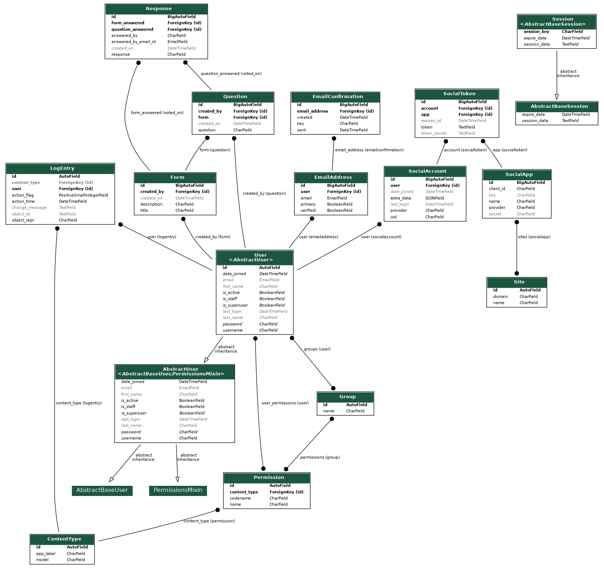
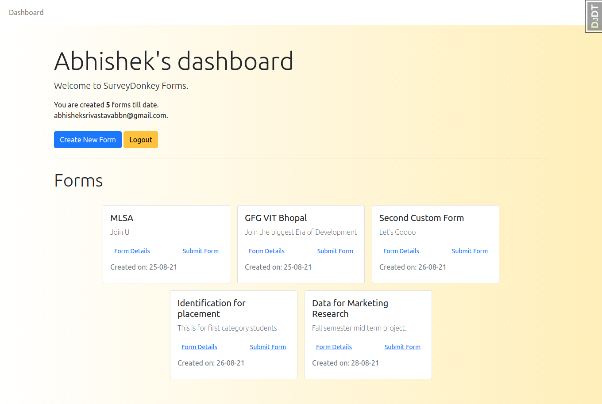
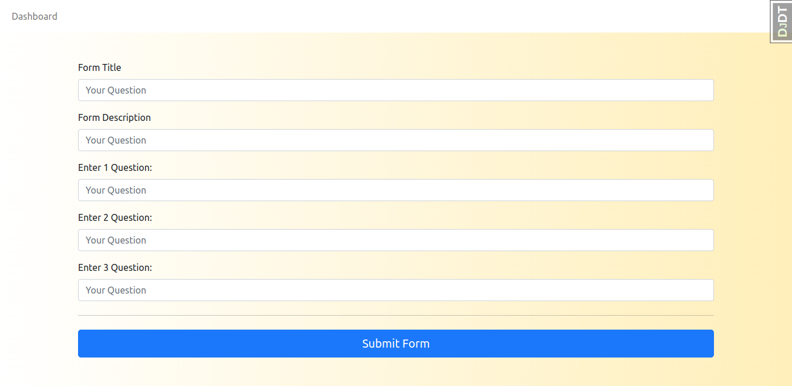
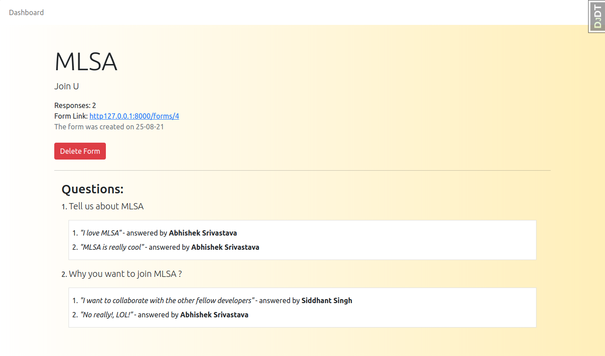
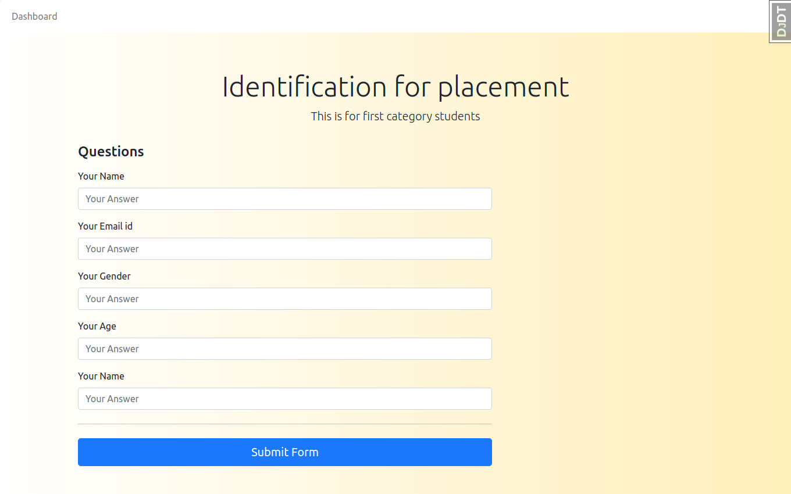

<h1> ✨ Donkey-Survey ✨ </h1>
<a href="https://donkeysurvey.herokuapp.com/">https://donkeysurvey.herokuapp.com/</a> 
 
<b> Create, share, Analyse Customer's data through surveys like never before  </b>
 

# Features 📋

- Refine Customer Experiences, The Better Way
- Do more than just surveys.
- Power-up your experience management programs.

# Database Diagram

# Optimisation Techniques 🧠 

## Implemented ✅
* Database Optimisation: Reducing SQL Queries (Most costly operation).
* Static File compression using WhiteNoise.
* Using Conditional Get Middleware or GZIP Middleware(`django.middleware.gzip.GZipMiddleware`)
* Writing Efficient Code
    * There are three prominent ways to lift the efficiency of the code:
        * Upgrading/Replacing the third-party packages
        * Simplifying the code
        * Restructuring the code
* SQL Logging
* Debug Toolbar: To monitor activities

## Further Improvements ⏲️

* Using a Caching Framework.
* Laziness to avoid computation in the first place. 
* QuerySets Specific Function
    * select_related()
    * prefetch_related()
* Enabling Memcached Server
* Using Elastic Search

# Application Walkthrough 🚲

## Landing Screen

## User's Dashboard 

## Creating a new form

## Form Detail Page

## Form to be shared with Customers

# Tech Stack 📊

- asgiref==3.4.1
- attrs==21.2.0
- cachetools==4.2.2
- certifi==2021.5.30
- cffi==1.14.6
- charset-normalizer==2.0.4
- coverage==5.5
- cryptography==3.4.7
- defusedxml==0.7.1
- Django==3.2.6
- django-allauth==0.43.0
- django-debug-toolbar==3.2.2
- django-extensions==3.1.3
- google-api-core==2.0.0
- google-api-python-client==2.18.0
- google-auth==2.0.1
- google-auth-httplib2==0.1.0
- google-auth-oauthlib==0.4.5
- googleapis-common-protos==1.53.0
- gspread==4.0.1
- gunicorn==20.1.0
- httplib2==0.19.1
- idna==3.2
- iniconfig==1.1.1
- oauth2client==4.1.3
- oauthlib==3.1.1
- packaging==21.0
- pluggy==0.13.1
- protobuf==3.17.3
- py==1.10.0
- pyasn1==0.4.8
- pyasn1-modules==0.2.8
- pycparser==2.20
- PyJWT==2.1.0
- pyparsing==2.4.7
- pytest==6.2.4
- pytest-cov==2.12.1
- pytest-django==4.4.0
- python3-openid==3.2.0
- pytz==2021.1
- requests==2.26.0
- requests-oauthlib==1.3.0
- rsa==4.7.2
- six==1.16.0
- sqlparse==0.4.1
- toml==0.10.2
- uritemplate==3.0.1
- urllib3==1.26.6
- whitenoise==5.3.0
