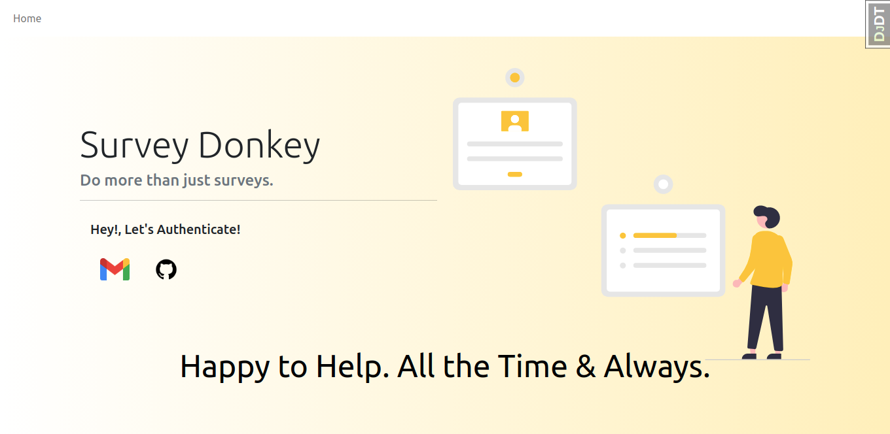

<h1>⚧️ Donkey-Survey ⚧️</h1>

<b>Create, share, Anayse Customer's data through surveys like never before</b>

# Features 📋

- Refine Customer Experiences, The Better Way
- Do more than just surveys.
- Power-up your experience management programs.

# Tech Stack 📊

* Django
* HTML/CSS/JS
* Heroku
* Docker

# Database Diagram

# Application Walkthrough 🚲

## Landing Screen

## User's Dashboard 

## Creating a new form

## Form Detail Page

## Form to be shared with Customers

